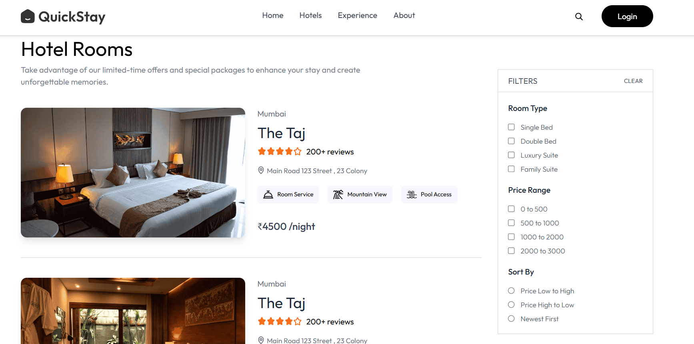
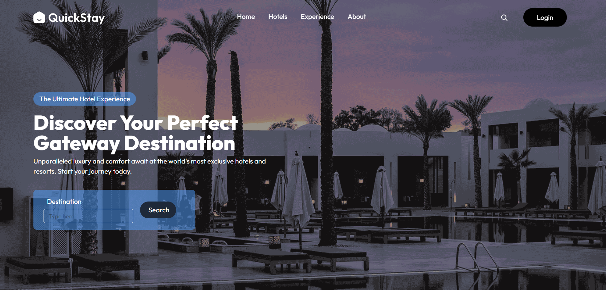
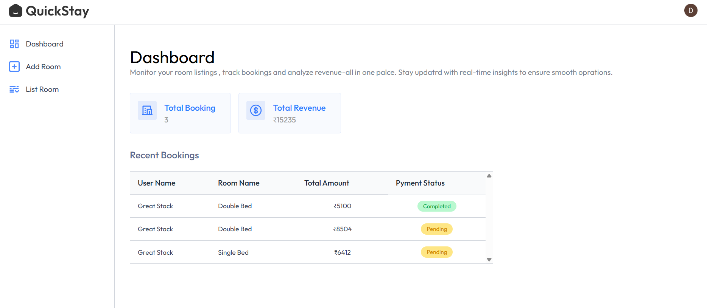
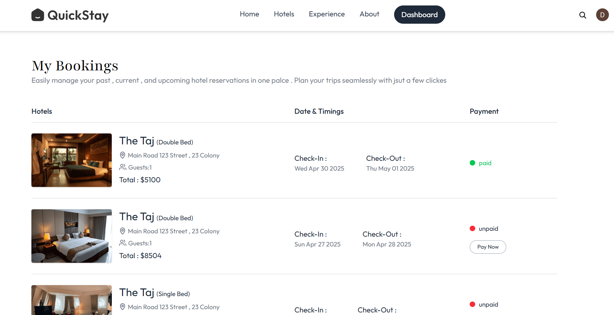

# 🏨 QuickStay

**QuickStay** is a fully responsive hotel booking web app built with **React**, **Tailwind CSS**, and **Clerk** for user authentication. It offers a user-friendly interface to explore hotel rooms, filter listings, and manage bookings.

---

## 🚀 Features

- ✅ Fully responsive landing page
- 🔐 User authentication with **Clerk**
- 🛏️ View all available rooms with clear layout
- 🔍 Search rooms by **location** and **date**
- 🎯 Filter rooms by **bed type** or **price range**
- 📝 Dummy booking functionality
- 👤 Logged-in users can view their booking details

---

## 📸 Screenshots

### 🖼️ room Listings

### 🏨 Landing page

### 📅 Liasting Room

### 👤 User Dashboard

git clone https://github.com/your-username/quickstay.git
cd quickstay
npm install
